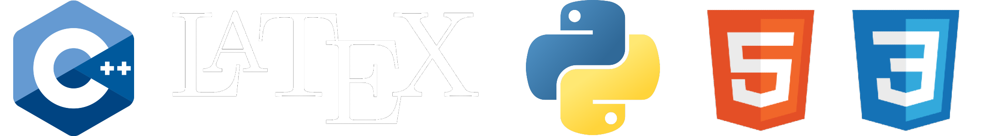
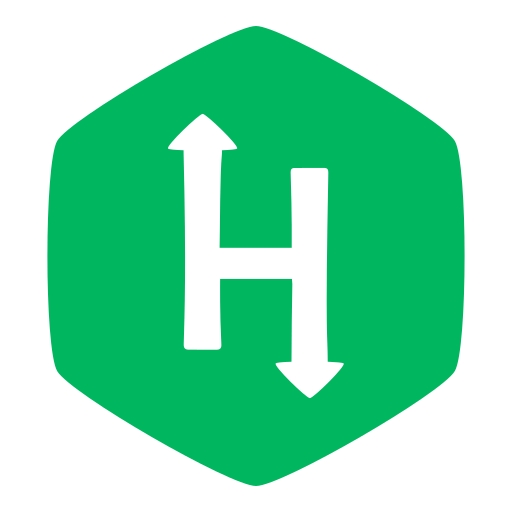

### Hello World! 👋 I am Hadrian 😃
- 🧠 ```Competitive programming``` for life
- ⚙️ Obsessed with ```computer science```, ```math```, ```astrophysics``` and ```electronics```
- 🌱 Practicing ```competitive programming```
- 🔨 I grind online judges daily
- 🐢 I have a pet turtle named Udon
### Languages 🌐
[](https://en.wikipedia.org/wiki/Programming_language)
### Socials 🤝
[](https://github.com/udontur)
[](https://judge.hkoi.org/user/wy_hadrianlau)
[](https://codeforces.com/profile/Lau_Needs_A)
[](https://leetcode.com/udontur/)
[](https://www.hackerrank.com/profile/udontur)
[](https://www.linkedin.com/in/hadrian-lau-45aa49266/)
