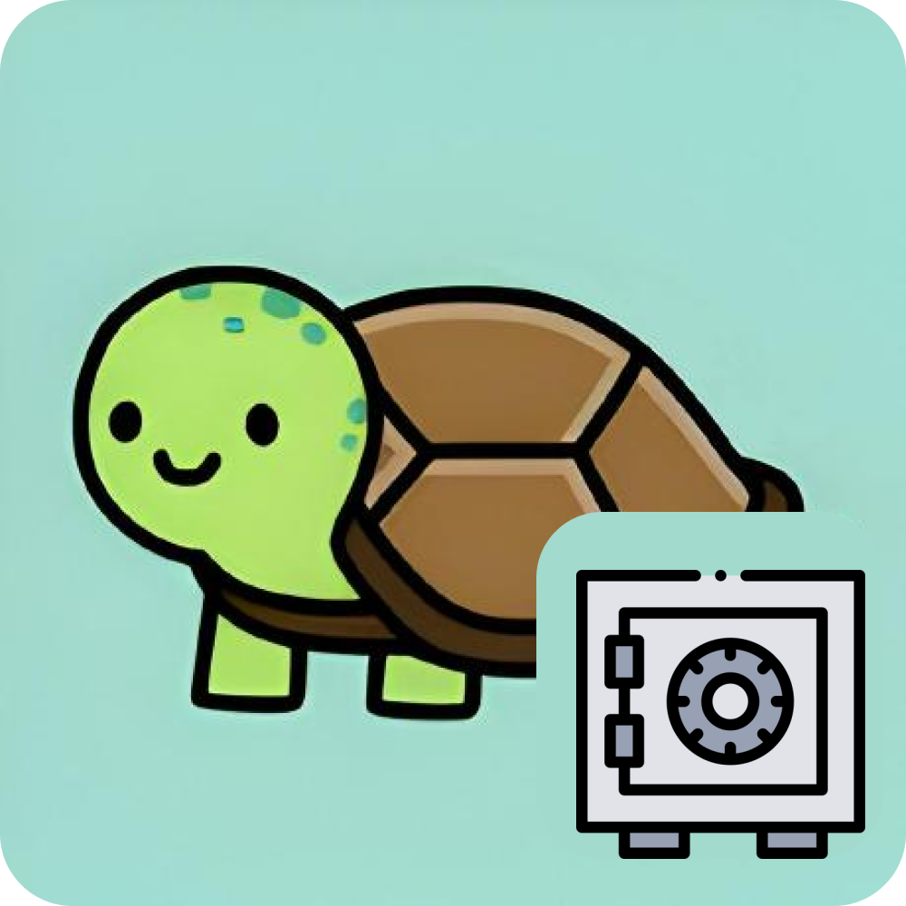
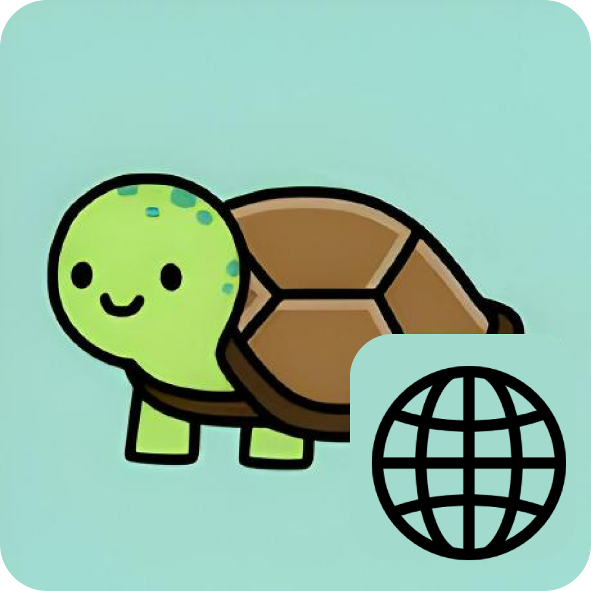
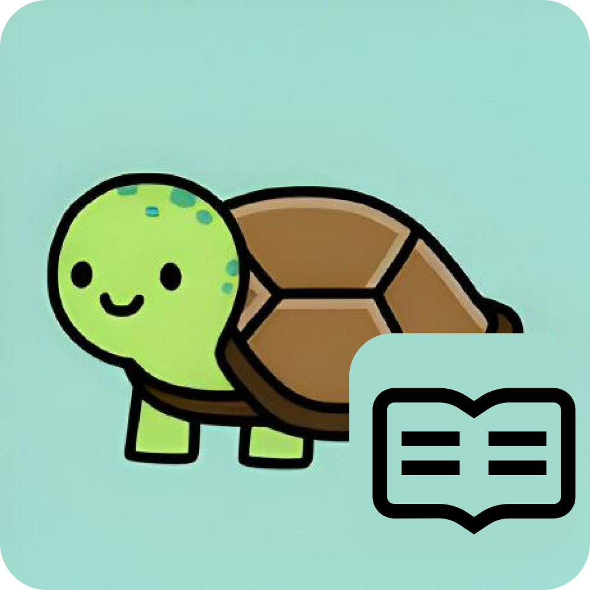

### Hello World! 👋 I am Hadrian 🐢
- 🧠 ```Computer Science``` and ```Mathematics``` enthusiast
- 🐢 I have a pet turtle call Udon
- 🖥️ My website: [hadrianlau.com](https://hadrianlau.com)
### Repositories 📖
[](https://github.com/udontur/cp)
[](https://github.com/udontur/udontur.github.io)
[](https://github.com/udontur/udontur)
### Competitive Programming 📈
[](https://leetcode.com/udontur)
[](https://codeforces.com/profile/udontur)
[](https://judge.hkoi.org/user/wy_hadrianlau)
### Languages 🌐
[]()
[]()
[]()
### Socials 🤝
[](https://www.linkedin.com/in/hadrianlaucs)
[](https://www.github.com/udontur)
[](https://www.instagram.com/udon.tur)
